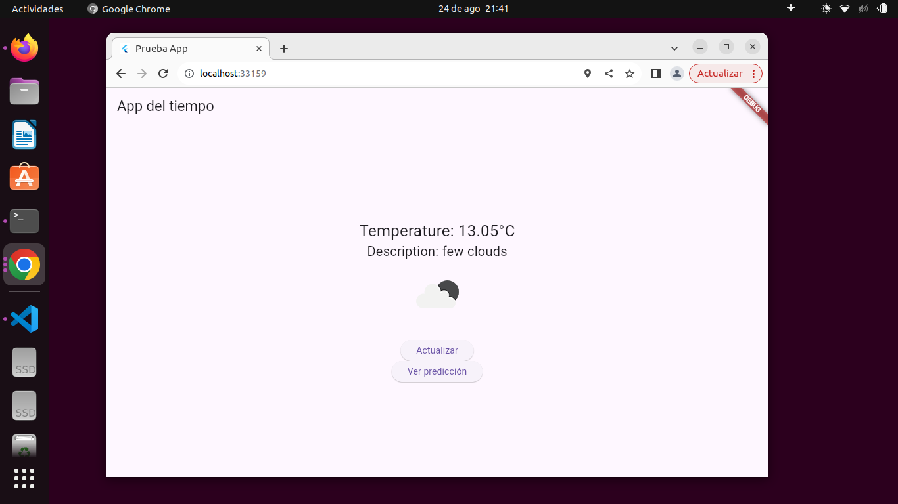
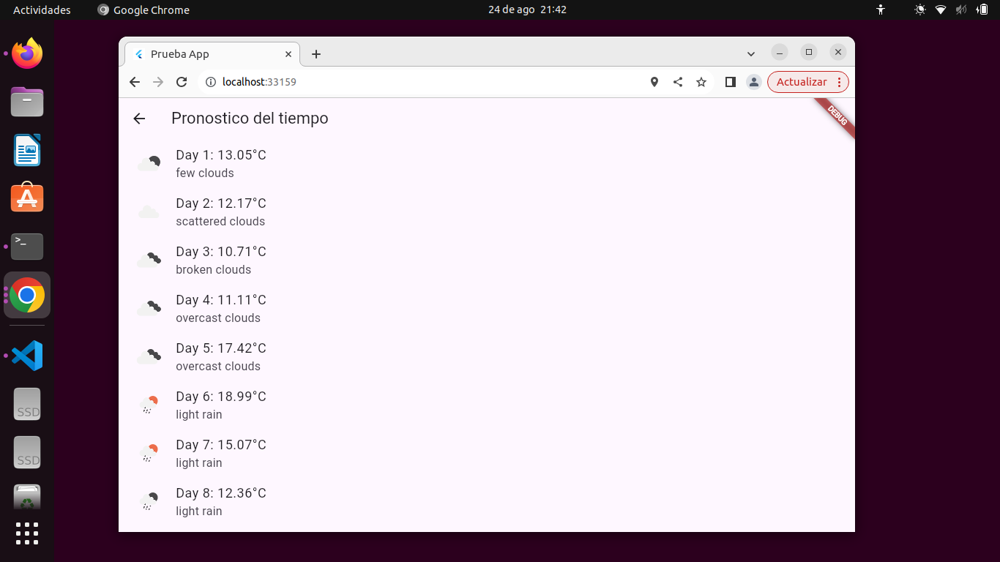

# flutter_application

Aplicacion que pronostica el tiempo

Descripcion del proyecto:
Aplicacion estructurada con Flutter que permite observar en primera instancia el estado del clima actual y cambiarlo conforme a un boton, por otra parte se pueden generar pronosticaciones del clima consecuentes a los dias siguientes.

Instrucciones de instalacion y ejecucion:
1. Tener instalado Visual Code, Flutter y Dart (Que se pueden instalar como extensiones de Visual Code)
2. Crear una carpeta en Visual Code, despues comando ctr+sift+p para crear un proyecto Flutter ( Flutter: new proyect) y finalmente selccionar
3. Creacion por defecto del main.dart (Importar dependecias) y se crea weather_service.dart, forecast_screen.dart
4. Cuando se crea weather_service.dart se añade una API key

Uso de API key:
Se utiliza la API Key de defecto de OpenWeather. No hay necesidad de reemplazarla, se incluye en el codigo

Evidencia: 

